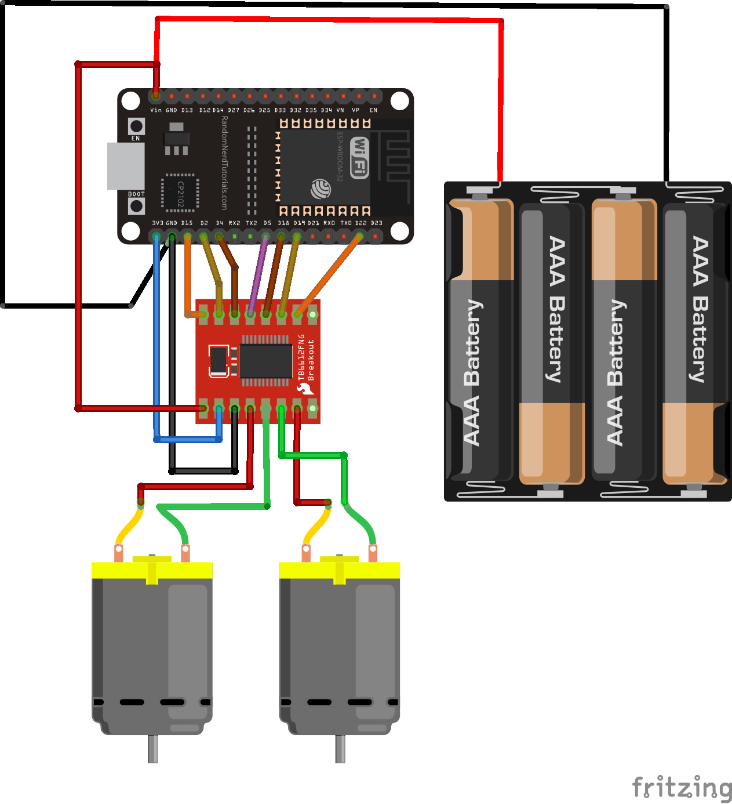

## Turn Kmart cheap robot to Arduino bluetooth controlled robot

#### Hardware parts

*  [ESP32 Devkit](https://www.aliexpress.com/premium/esp32-devkitc-v4.html?d=y&origin=y&catId=0&initiative_id=AS_20210405200508&SearchText=esp32%20devkitc%20v4)
*  [Tb6612fng](https://www.aliexpress.com/wholesale?catId=0&initiative_id=AS_20210405200515&isPremium=y&SearchText=tb6612fng)
*  [Kmart bi-wheel cheap robot](https://www.kmart.com.au/product/interactive-robot/2886866)
* ps3 bluetooth controller

##### Wiring

#### Software
* [Arduino IDE](https://www.arduino.cc/en/software/)
*

#### Steps

* Enable cp210 driver, Linux kernel 5.0 includes its driver.`sudo modprobe cp210x`
* Add tb6612fng lib to Arduino IDE https://github.com/vincasmiliunas/ESP32-Arduino-TB6612FNG (download latest 1.0.2 zip from release)
* ps3 pairing
https://github.com/jvpernis/esp32-ps3
* Flashing with Arduino IDE `sketch_ps3.ino`
